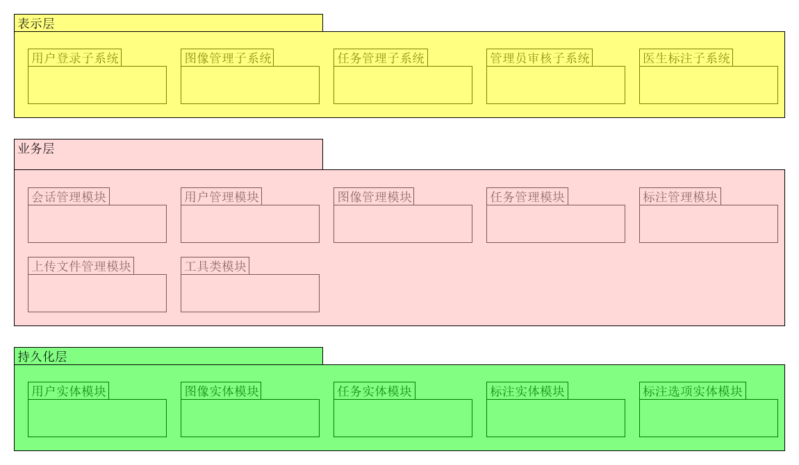

# 作业

- 描述软件架构与框架之间的区别与联系

  - 区别：架构是抽象的描述，而框架是具体的语言实现。
  - 联系：针对架构运用框架解决问题，同时框架的开发是基于架构的。

- 以你的项目为案例

  - 绘制三层架构模型图，细致到分区

    

  - 结合你程序的结构，从程序员角度说明三层架构给开发者带来的便利

    - 设计：设计阶段，前后端之间只需要共同协定 API 的设计，而不需要考虑具体的语言，框架等因素。
    - 开发：在已有的 API 文档的基础上，前后端的开发可以并发进行，互不干扰。
    - 测试：前端可以利用 mock 测试，后端可以利用 curl/wget 等命令或框架自带的 GUI 完成测试，前后端达到分离测试，减少了集成测试时出现问题的概率，减少回归成本。
    - 维护：层与层之间的分离使得维护变得更为简单。

- 研究 VUE 与 Flux 状态管理的异同

  - vuex：

    

  - flux：

    