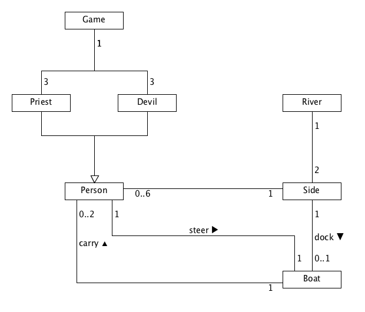

# 领域建模

> 下面是关于领域建模学习的知识汇总。

**领域模型**是对领域内的概念类或现实世界中对象的可视化表示。

应用 UML 表示法，领域模型被描述为一组没有定义操作（方法的特征标记）的类图。它提供了概念透视图。它可以展示：

- 领域对象或概念类
- 概念类之间的关联
- 概念类的属性：`visibility name : type multiplicity = default { property-string }`

## 简单实践

### 学校管理系统

1. 数据表及字段

   | 实体   | 属性                       |
   | ------ | -------------------------- |
   | 系     | 系名，系主任               |
   | 学生   | 学号，姓名，学生所属系     |
   | 教师   | 工作证号，姓名，教师所属系 |
   | 研究生 | 专业方向                   |
   | 教授   | 研究领域                   |
   | 课程   | 课程号，名称，学分         |

2. 关系描述

   - 学生每**学期**要选修若干门课程，每门课有一个考试**成绩**。
   - 某个学期开设的某门课程只有一个**任教教师**。
   - 一个教师只任教一门课。
   - 一个教师有能力讲授多门课程，一门课程也可以存在多位教师有能力进行讲授。
   - 每个研究生只能跟随一位教授。

**请采用面向对象方法描述该问题的域领域模型。**

下面是一个简单的示例（？）

### Priests and Devils

请阅读游戏脚本：

> Priests and Devils is a puzzle game in which you will help the Priests and Devils to cross the river within the time limit. There are 3 **priests** and 3 **devils** at one side of the **river**. They all want to get to the other side of this river, but there is only one **boat** and this boat can only carry two persons each time. And there must be one person steering the boat from one side to the other side. In the flash game, you can click on them to move them and click the go button to move the boat to the other direction. **If the priests are out numbered by the devils on either side of the river, they get killed and the game is over.** You can try it in many ways. Keep all priests alive! Good luck!

1. 列出游戏中涉及的事物（Objects）
2. 对类进行领域建模
3. 识别行为规则与约束

下面是一个简单的示例（？）

## 状态建模

