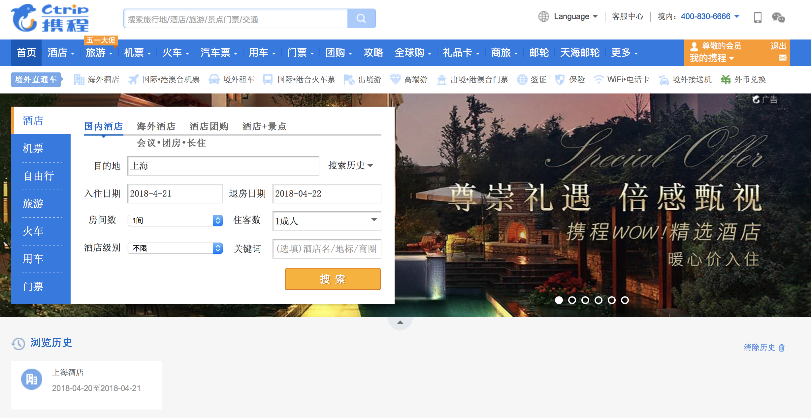
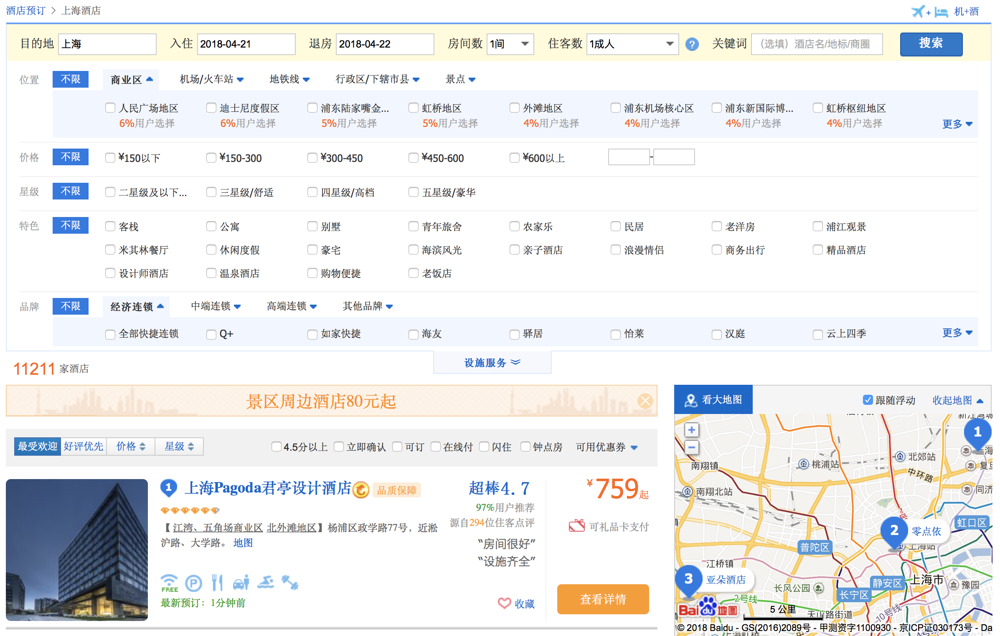
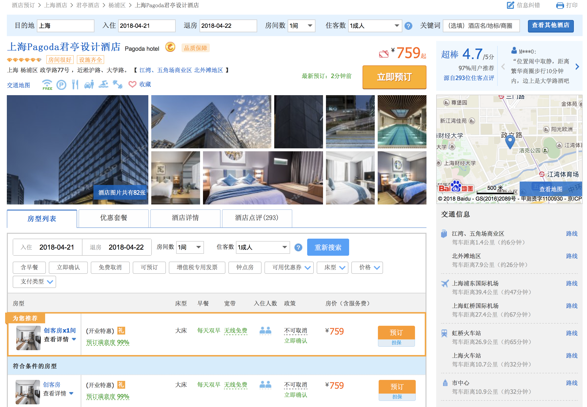
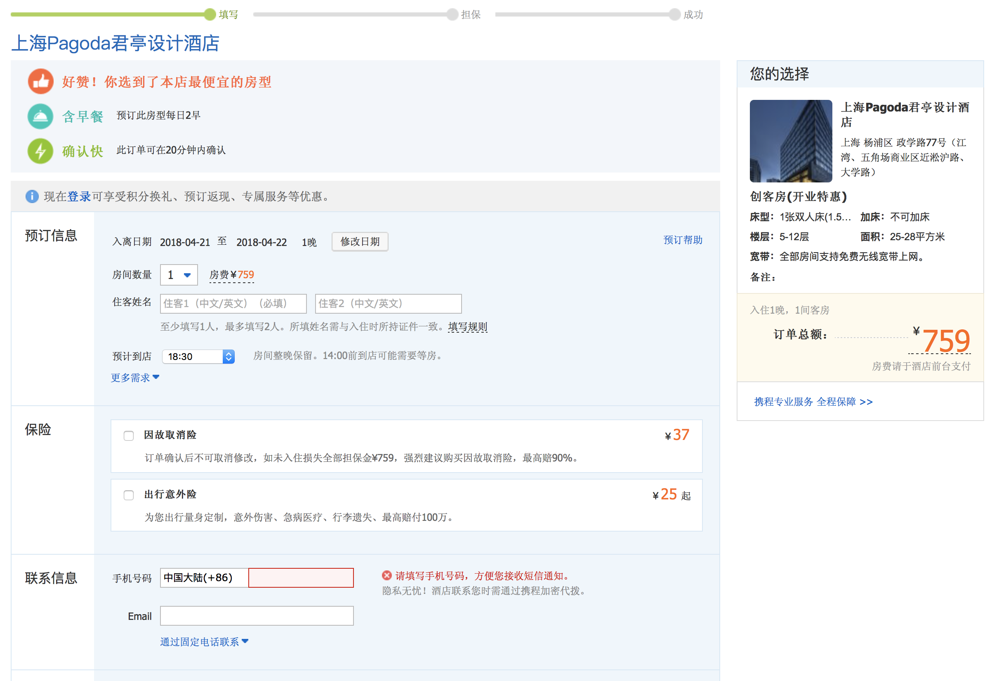
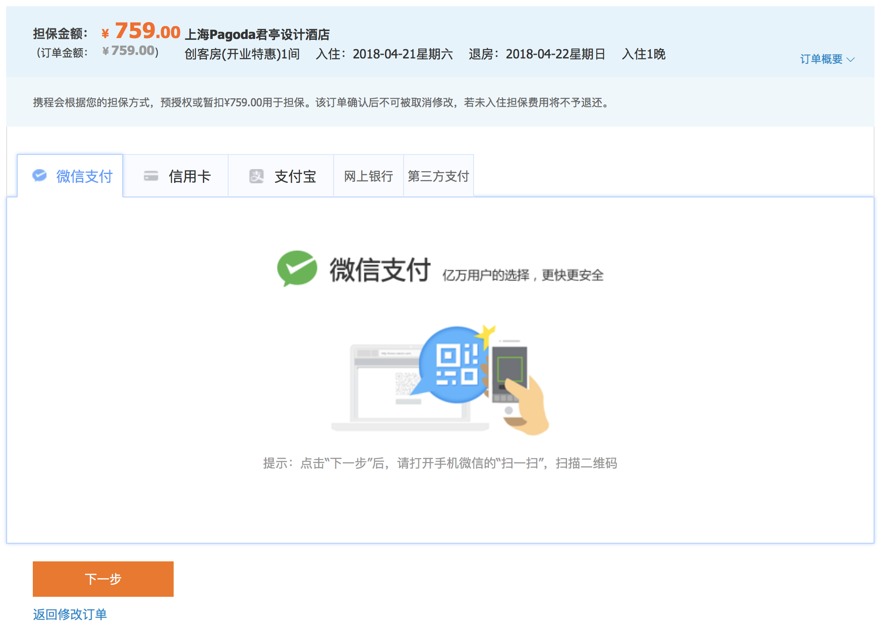

# 建模实践

> 这是个人作业，下面是作业要求：
>
> - 按 full 用例模板，使用 UI-free 风格，至少编制一个完整的用户目标级别用例。
> - 编制一些非正式的 casual 用例。为了描述简洁，可以使用 UI 和 activity diagram 辅助陈述用户需求。
> - 编制一些 brief 用例

## 用例建模

- 任务 A：根据下面「预定酒店」的内容，按要求使用工具 UMLet绘制用例图。 

  下图表示在搜索酒店时，旅客或顾客可以输入相关信息或选择分类进行搜索；

  

  下图表示在选择完酒店后，选择房间的类型；

  

  下图表示在确认预定添加到购物篮时，用户需要输入全名和邮箱；

  

  下图是在购物篮里确认支付的流程。

  

  根据上述内容，绘制用例图如下：

  

- 任务 B：选择熟悉的定旅馆在线服务系统（或移动 APP），绘制用例图。并满足以下要求：

  - 对比任务 A 的用例图，用色彩标注出创新用例或子用例
  - 识别外部系统，并用色彩标注新的外部系统和服务

  这里选择了「携程」的预定酒店网页应用：

  下图是进入网站的首页，包含了酒店的搜索入口。（值得注意的是，浏览历史被显著地展示在下方）

  

  下图是通过搜索酒店后的信息列表，这里包含了许多维度的筛选项。

  

  下图是酒店的详情页面，展示了符合条件的房型列表，并置顶了推荐房型。

  

  下图是进入预订的核心流程的第一个页面：填写顾客相关信息以及可选保险服务。

  

  下图是转跳的第二个页面：选择支付方式来支付保证金。

  

  根据预订流程的显示，最后一个为成功页面，这里并未实际预订，所以无法确定具体内容。

  下面根据要求绘制用例图：

  ​

- 任务 C：对比两个时代、不同地区产品的用例图，总结在项目早期，发现创新的思路与方法。

- 任务 D：使用 SCRUM 方法，在任务 B 的用例图基础上，编制某定旅馆开发的需求 （backlog）。

## 业务建模

- 在任务 B 的基础上，用活动图建模找酒店用例。简述利用流程图发现子用例的方法。
- 选择身边的银行 ATM，用活动图描绘取款业务流程。
- 查找淘宝退货业务官方文档，使用多泳道图，表达客户、淘宝网、淘宝商家服务系统、商家等用户和系统协同完成退货业务的过程。分析客户要完成退货业务，在淘宝网上需要实现的系统用例。

## 用例文本编写

- 分析三种用例文本的优点和缺点