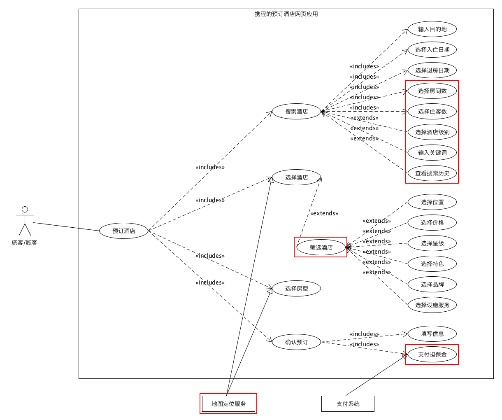
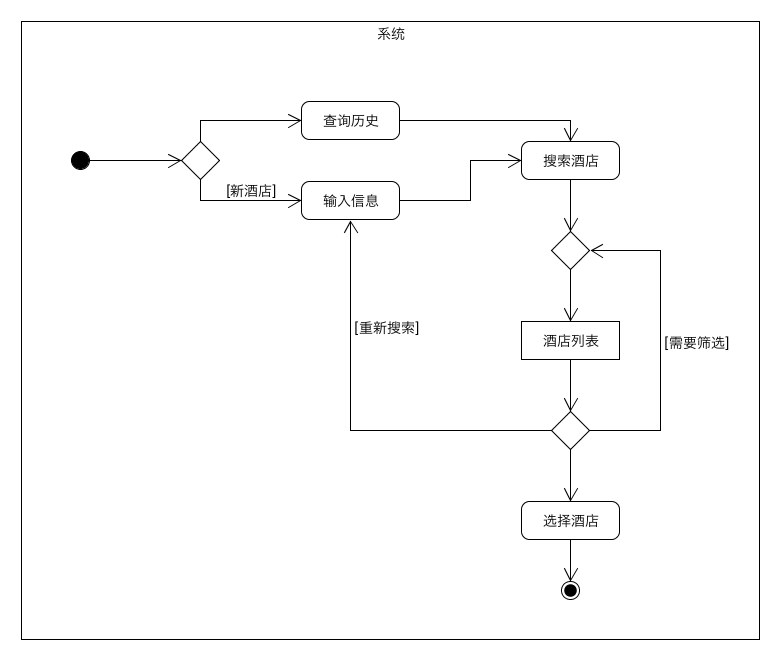
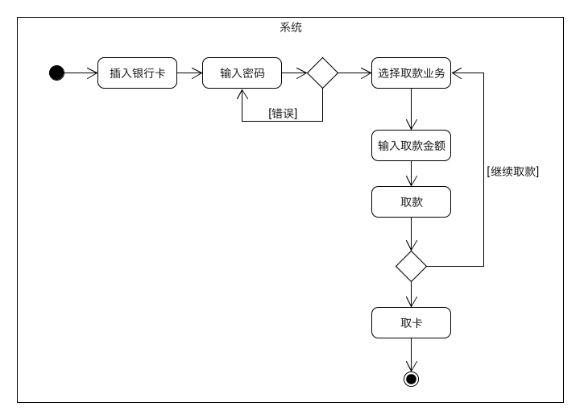
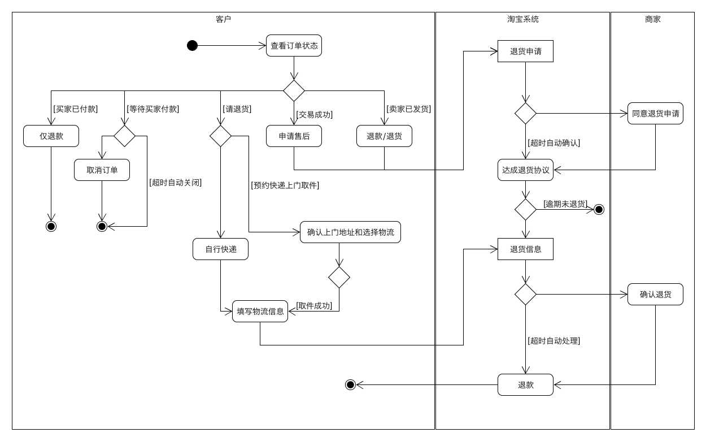

# 建模实践

> 这是个人作业，下面是作业要求：
>
> - 按 full 用例模板，使用 UI-free 风格，至少编制一个完整的用户目标级别用例。
> - 编制一些非正式的 casual 用例。为了描述简洁，可以使用 UI 和 activity diagram 辅助陈述用户需求。
> - 编制一些 brief 用例

## 用例建模

- 任务 A：根据下面「预定酒店」的内容，按要求使用工具 UMLet绘制用例图。 

  下图表示在搜索酒店时，旅客或顾客可以输入相关信息或选择分类进行搜索；

  

  下图表示在选择完酒店后，选择房间的类型；

  

  下图表示在确认预定添加到购物篮时，用户需要输入全名和邮箱；

  

  下图是在购物篮里确认支付的流程。

  

  根据上述内容，绘制用例图如下：

  

- 任务 B：选择熟悉的定旅馆在线服务系统（或移动 APP），绘制用例图。并满足以下要求：

  - 对比任务 A 的用例图，用色彩标注出创新用例或子用例
  - 识别外部系统，并用色彩标注新的外部系统和服务

  这里选择了「携程」的预定酒店网页应用：

  下图是进入网站的首页，包含了酒店的搜索入口。（值得注意的是，浏览历史被显著地展示在下方）

  

  下图是通过搜索酒店后的信息列表，这里包含了许多维度的筛选项。

  

  下图是酒店的详情页面，展示了符合条件的房型列表，并置顶了推荐房型。

  

  下图是进入预订的核心流程的第一个页面：填写顾客相关信息以及可选保险服务。

  

  下图是转跳的第二个页面：选择支付方式来支付保证金。

  

  根据预订流程的显示，最后一个为成功页面，这里并未实际预订，所以无法确定具体内容。

  下面根据要求绘制用例图，其中红色方框标注的是创新点：

  

  ​

- 任务 C：对比两个时代、不同地区产品的用例图，总结在项目早期，发现创新的思路与方法。

  由于前者是在互联网初期而接入线上服务的酒店数量较少，而后者则面临海量的酒店信息，所以此时在项目早期的规划中，如何帮助顾客更快更准确地找到自己想要的酒店就显得尤为重要。因此，从两个用例图来看，后者在排序服务的基础上添加了丰富维度的筛选服务。而技术的发展也使得后者在支付流程上更为简单，提供了扫码支付的方式。

  一个更深层次的改变在于信息的关联上，后者连接了目的地的本地服务信息与地图信息，并且建立了用户评价体系帮助顾客更好地找的舒适的酒店。

  由此可见，发现创新的思路与方法基于互联网的连接本质，在这个例子中互联网连接了人与酒店这样的基础设施与服务，因此解决如何准确匹配这样的连接是关键。

  而进一步在这样的关系中，人作为连接发起方，为了让其清晰地描述出自己的需求的方法有显式地分类选择，而**充分地展示本地服务可以来挖掘顾客潜在的需求**。

  因为在互联网上的关系双方都缺少互相的信任，因此社区的评价有利于建立酒店的可信度量，而担保金的业务逻辑也是为了建立顾客对于酒店的契约承诺。

- 任务 D：使用 SCRUM 方法，在任务 B 的用例图基础上，编制某定旅馆开发的需求 （backlog）。

  | #    | Title      | Est  | Iter | Imp  |
  | ---- | ---------- | ---- | ---- | ---- |
  | 1    | 搜索酒店   | 5    | 1    | 5    |
  | 2    | 筛选酒店   | 10   | 2    | 3    |
  | 3    | 支付担保金 | 3    | 1    | 5    |

## 业务建模

- 在任务 B 的基础上，用活动图建模**找酒店**用例。简述利用流程图发现子用例的方法。

  

- 选择身边的银行 ATM，用活动图描绘**取款业务**流程。

  

- 查找淘宝**退货业务**官方文档，使用多泳道图，表达客户、淘宝网、淘宝商家服务系统、商家等用户和系统协同完成退货业务的过程。分析客户要完成退货业务，在淘宝网上需要实现的系统用例。

  参考文档为淘宝网服务中心的[如何退货？](https://consumerservice.taobao.com/self-help#page=issue-detail&knowledgeId=1119776)

  

  完成退货业务所需要的系统用例：

  - 发起退货申请
  - 达成退货协议
  - 确认退货信息
  - 完成退款

## 用例文本编写

- 分析三种用例文本的优点和缺点
  - **简洁**的用例文本：用很少的句子组成来总结用例，适合电子表格中计划软件开发（其它列为优先级、复杂度、版本号等）。优点是编写简单，并且简洁明了；缺点是描述粗略。
  - **非正式**的用例文本：由文本段落组成，包括了表格的所有列，用总结或故事的形式详细的描述用例。优点是编写简单，能够描述清楚问题；缺点时不够正式，后续还需要精细化。
  - **详尽**的用例文本：这是以包含了不同部分的长模板为基础的正规文档。优点是细节充足，具有结构性；缺点是编写繁琐耗时。

##实践中存在的主要问题

⚠️ 不符合有效用例三准则，特别是单步操作准则

⚠️ 外部系统或服务的识别不正确，出现 database 等技术设施

⚠️ 包含与拓展关系不是执行顺序

⚠️ 活动图没有分支、归并节点