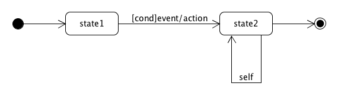

# 状态建模

> 下面是关于状态建模学习的知识汇总。

## 为什么要状态建模？

领域模型描述了问题域中事物及其之间的关系与量化的约束，我们需要进一步验证模型的有效性与完备性，管理这些事物的生命周期成为有效的方法——状态建模。它主要解决以下问题：

- 从实例的角度识别业务事件，完善、优化业务过程的细节，细化业务过程与领域模型
- 给出业务过程合理性与完备性验证
- 为程序开发提供业务规范细节

在软件分析与设计中，状态图是**业务逻辑合理性分析**的最重要工具。

## UML 状态建模符号体系

状态图描述一个**事物或对象**受**事件或消息**刺激产生可见的状态（属性/属性组合）的数据变化。

- 基础符号
  - 起始状态（Initial）、终止状态（Final）
  - 取消/对象取消（Termination）
  - 状态（State）
  - 变迁（Transform），含条件（Condition）、事件（Event）和事件处理动作（Action/Handler）
- 拓展符号
  - 复合状态
  - 信号

⚠️ 注意事项：

- 必须有起始状态，通常有终止和取消状态
- 状态命名要用名词短语、动词过去时或正在进行时等具有延续性的词汇
- 在需求分析过程中，尽可能不涉及动作

## 状态建模的场景与步骤

**应用场景**：

- 需求建模。与客户讨论关键事物的变化过程；进一步细化用例图或用例场景。
- OOD/P 软件设计。关键数据的变化；表达状态机；状态机模式（GOF）。

**工作步骤**：

1. 确定研究对象
   - 通常是客户关注的业务交易实体，如订单，凭证等
2. 识别状态集合
   - I，F，S={S0...Sk}
   - 状态不一定是门的开或关闭这样简单属性，可能是属性复杂的组合
   - 事物中包含的 mode 和 state 属性
3. 识别事件和变迁条件
4. 合理性、完整性检查与逻辑分析
   - 终点的可达性
   - 悬挂状态
   - 循环分析（死循环条件与风险）
   - 路径分析（最短路径、关键路径、平均距离）

## 案例研究

**Priests and Devils**

💡 提示：游戏初始状态为 [PPPDDD]B-[]，终止状态 []-B[PPPDDD]，其中 [] 表示河岸、P 表示Priest、D 表示Devil、B 表示Boat。

**酒店房间的状态建模**

- 状态集合 S = { 可用，维护中，锁定，预定，使用中 }
- 常见事件 E = { 电话预定，网上预定，支付，入住，**取消**预定？，换房 ... ，退房 }